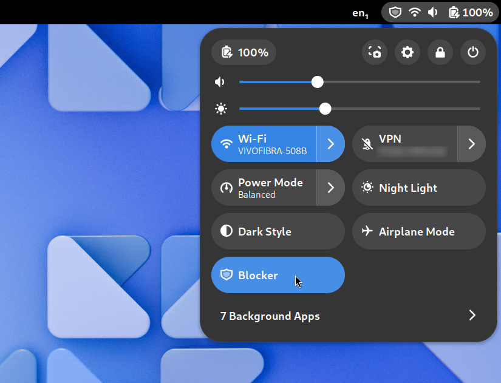
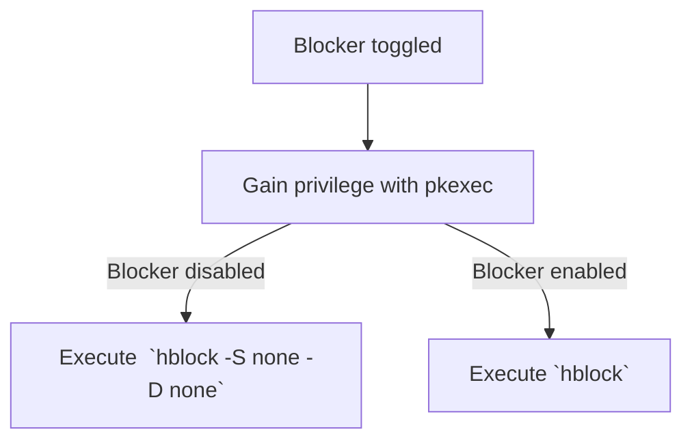

<h1> Blocker</h1>

A content blocker for your entire computer.

## Getting started

### Installation

Blocker depends on hblock, which you can install by following the instructions laid out here [here](https://github.com/hectorm/hblock/blob/master/PACKAGES.md). After installing hblock, you can install Blocker itself through the GNOME Extensions website.


### Usage

Click the Quick Settings toggle and input your user's password to activate Blocker (it will take a while to download all its denylists). Once Blocker is active, it will display a system indicator of a shield. To turn it off, simply click the toggle and input your password again.



## FAQ

### How does it work?

This GNOME Shell extension is just a convenient frontend for [hblock](https://github.com/hectorm/hblock/), which does all the heavy lifting. Here's what happens when you toggle Blocker:

First, Blocker uses pkexec (the program that prompts you for your password) to gain super user privilege, which is required to run hblock. Then, if you enabled Blocker, it enables hblock by running `hblock`. If you disabled Blocker, it disables hblock by running `hblock -S none -D none`. I couldn't resist a flowchart...



### What are its limitations?

Blocker is powered by hblock, so its limitations are Blocker's limitations.

The content blocking strategy used by hblock is [DNS blocking](https://en.wikipedia.org/wiki/DNS_blocking). That means that any connections that do not depend on name resolution cannot be blocked using this approach, such as accessing an IP address directly. Additionally, certain applications may set their own DNS settings (e.g. Firefox, when it uses DNS over HTTPS) instead of adhering to the system's configuration. Finally, your DNS settings may be affected if you are using a VPN, which tipically route your DNS queries to its own resolvers.

### How do I know it's working?

Visit https://hblock.molinero.dev, it tells you whether hblock is active or not. This is does that by checking if connections to https://hblock-check.molinero.dev are blocked, which is the case for hblock's default configuration.

### Can I customize the denylist?

Blocker does not provide, not plans to provide, that kind of customization. However, you can do that if you hblock directly in the terminal, using `-A`, `-D`, and `-S` flags. Run `hblock --help` for more details.

### Where should I report problems?

For false positives, report in [hblock's issue tracker](https://github.com/hectorm/hblock/issues). For everything else, report in [Blocker's issue tracker](https://github.com/pesader/gnome-shell-extension-blocker/issues).

## Contributing

To build and install the extension run:

```bash
gnome-extensions pack --force --extra-source=icons &&  gnome-extensions install blocker@pesader.dev.shell-extension.zip --force
```

You can run a nested session of GNOME Shell to test the extension out with:

```bash
dbus-run-session -- gnome-shell --nested --wayland
```

If you want to change the size of the window of the nested session, set the `MUTTER_DEBUG_DUMMY_MODE_SPECS` environment variable (as advised [here](https://www.youtube.com/watch?v=YjMgtUSYg4w&t=1890s)), like so:

```bash
env MUTTER_DEBUG_DUMMY_MODE_SPECS=1024x768 dbus-run-session -- gnome-shell --nested --wayland
```

## Attribution

### Assets

- Blocker's logo: derived from the [`shield-safe-symbolic`](https://gitlab.gnome.org/World/design/icon-library/-/blob/master/data/resources/icon-dev-kit/shield-safe-symbolic.svg?ref_type=heads) icon, by the GNOME Project.
- EGO banner: modified from [Just Perfection's work](https://gitlab.gnome.org/jrahmatzadeh/just-perfection/-/blob/main/data/imgs/ego.svg?ref_type=heads).

### Code

- Run shell commands asynchronously: heavily inspired by the [GJS documentation examples](https://gjs.guide/guides/gio/subprocesses.html) as well as by the [RunCommand plugin for GSConnect](https://github.com/GSConnect/gnome-shell-extension-gsconnect/blob/main/src/service/plugins/runcommand.js).
- Assign a custom icon to the Quick Settings toggle: based on the codebase from [Caffeine](https://github.com/eonpatapon/gnome-shell-extension-caffeine).

## Gratitude

This project would not exist if it weren't for hblock, so I thank its maintainer and all its contributors. I'm also grateful to everyone in the GNOME Extensions matrix room, who kindly answered the many questions that came up while I was writing this program.

## License

This project is licensed under the terms of the GPLv3.
