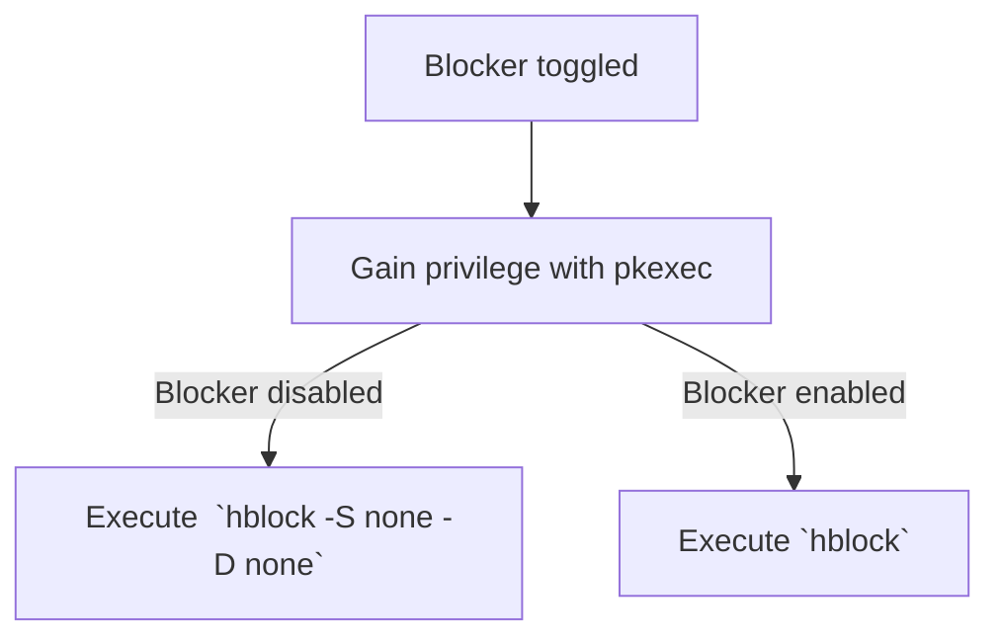

<h1> Blocker</h1>

A content blocker for your entire computer.

## Installation


## How it works

This GNOME Shell extension is just a convenient frontend for [hblock](https://github.com/hectorm/hblock/), which does all the heavy lifting. Here's what happens when you toggle Blocker:

First, Blocker uses pkexec (the program that prompts you for your password) to gain super user privilege, which is required to run hblock. Then, if you enabled Blocker, it enables hblock by running `hblock`. If you disabled Blocker, it disables hblock by running `hblock -S none -D none`. I couldn't resist a flowchart...



## Limitations

Blocker is powered by hblock, so its limitations are Blocker's limitations.

The content blocking strategy used by hblock is [DNS blocking](https://en.wikipedia.org/wiki/DNS_blocking). That means that any connections that do not depend on name resolution cannot be blocked using this approach, such as accessing an IP address directly. Additionally, certain applications may set their own DNS settings (e.g. Firefox, when it uses DNS over HTTPS) instead of adhering to the system's configuration. Finally, your DNS settings may be affected if you are using a VPN, which tipically route your DNS queries to its own resolvers.

## Contributing

To build and install the extension run:

```bash
gnome-extensions pack --force --extra-source=icons &&  gnome-extensions install blocker@pesader.dev.shell-extension.zip --force
```

You can run a nested session of GNOME Shell to test the extension out with:

```bash
dbus-run-session -- gnome-shell --nested --wayland
```

If you want to change the size of the window of the nested session, set the `MUTTER_DEBUG_DUMMY_MODE_SPECS` environment variable (as advised [here](https://www.youtube.com/watch?v=YjMgtUSYg4w&t=1890s)), like so:

```bash
env MUTTER_DEBUG_DUMMY_MODE_SPECS=1024x768 dbus-run-session -- gnome-shell --nested --wayland
```

## Attribution

Blocker's logo was derived from the [`shield-safe-symbolic`](https://gitlab.gnome.org/World/design/icon-library/-/blob/master/data/resources/icon-dev-kit/shield-safe-symbolic.svg?ref_type=heads) icon, by the GNOME Project.

## Gratitude

This project would not exist if it weren't for hblock, so I sincerely thank its maintainer and all its contributors.

## License

This project is licensed under the terms of the GPLv3.
